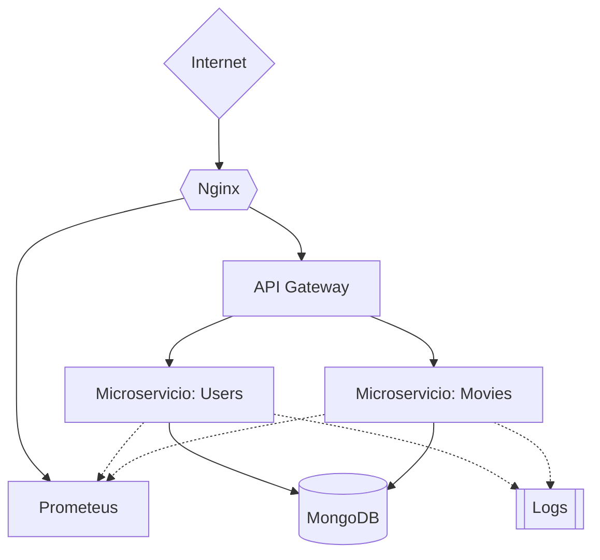
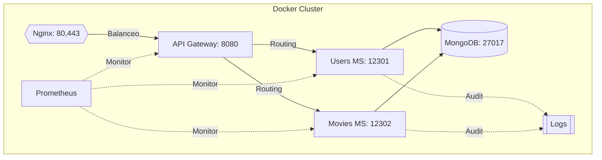

# 🎬 API Gateway (Arquitectura DDD)

**Autor:** Alexander Rubio Cáceres  
**Rol:** Ingeniero de Software | Especialista en Seguridad de la Información | Desarrollador Full Stack MERN  

  
  

---

## 📌 Visión del Proyecto

API REST construida bajo **Domain-Driven Design (DDD)** para la gestión de películas vía streaming, enfocada en:

- ✅ **Lenguaje ubicuo** entre desarrolladores y expertos del dominio  
- ✅ **Microservicios** desacoplados y escalables  
- ✅ **Seguridad multicapa** desde el acceso hasta la base de datos

---

## 🏗️ Arquitectura General

## 🐳 Diagrama de Despliegue Docker

### Características clave del diagrama:
1. **Aislamiento de Bases de Datos**: MongoDB separado para microservicios.
2. **Balanceador de Carga**: Nginx maneja tráfico entrante.
3. **Monitorización**: Integración con Prometheus.
4. **Variables de Entorno**: Configuración segura por servicio.
5. **Persistencia**: Volúmenes Docker para datos y código.
6. **Auditoría**: Centralización de logs, eventos de los Microservicios.

### Instrucciones para el Despliegue
1. **Requisitos previos**: Instalar (En Linux) docker, containerd, docker-compose [En Windows docker-desktop] y postman
2. **Clonar el proyecto**: git clone https://github.com/imeshinnovation/proyecto_ddd.git
3. **Desplegar**: docker-compose up -d --build
4. **Ejecutar Pruebas**: Importar en Postman el set de pruebas alojado en el directorio testing_set
